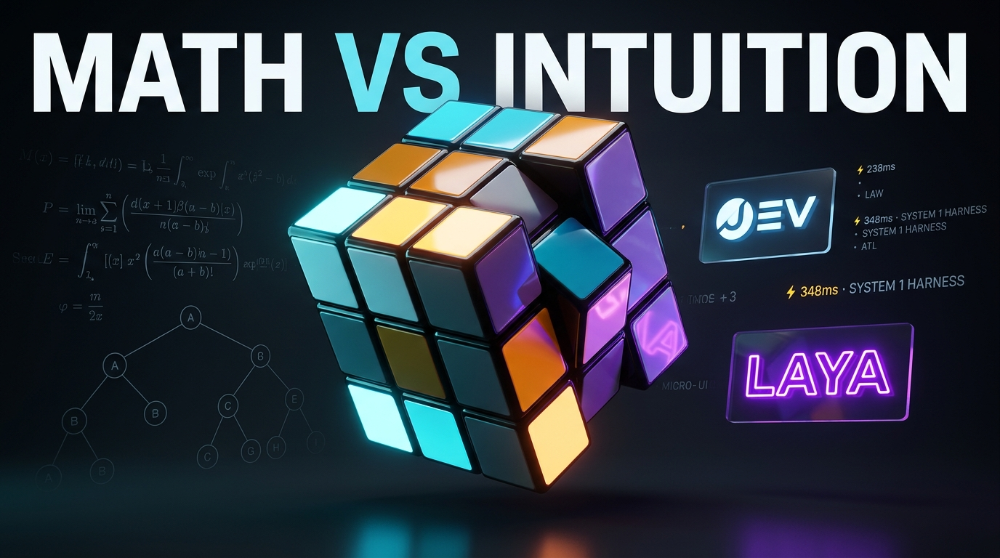

# System 1 Speedcuber: Autonomous Cognitive Agent Studio ⚡🎲
### Powered by Laya ModernBERT 421M + TypeSafe Jev

[](https://huggingface.co/convaiinnovations/laya)
[](https://typesafe.ai)
[](https://laya.studio)
[](https://vitest.dev)
[](https://www.typescriptlang.org)
[](https://github.com/astral-sh/uv)
[](LICENSE)

An open-source, real-time **System 1 Cognitive Agent Harness** for 3D Rubik's cube manipulation. Powered by local **ModernBERT-large (421M)** weights via [Convai Laya](https://huggingface.co/convaiinnovations/laya) and [TypeSafe Jev](https://typesafe.ai).

Runs **100% locally** on your machine with **sub-350ms neural inference**, zero cloud API dependencies, and zero hallucinated tokens.

---

<p align="center">
  <a href="https://github.com/harshavarma02/system1-jev-laya-agent/raw/main/assets/demo.mp4">
    
  </a>
  <br />
  <a href="https://github.com/harshavarma02/system1-jev-laya-agent/raw/main/assets/demo.mp4">
    
  </a>
</p>

<p align="center">
  <em>⚡ Click the banner or button above to play the full 1080p demonstration video.</em>
</p>

---

## 💡 Why This Exists: Beyond Cold Math & Trivial Routing

Following the release of frontier non-autoregressive **System 1 models** like Jev and Laya in September 2026, most community use cases stopped at pedestrian text routing—ticket categorization, email triage, and spam filtering.

Meanwhile, traditional Rubik's cube solvers (Kociemba, IDA*, group-theory coset solvers) brute-force optimal 20-move paths. **They solve puzzles with cold mathematics, but they do not think like humans.**

Humans don't run 20-ply graph search trees in their heads. A human speedcuber uses **hierarchical stage decomposition** and **intuitive pattern recognition**:
1. Observe the current 3D spatial state and recall working memory of the active stage.
2. Intuitively evaluate which macro-algorithm fits the situation best with gut probability.
3. Physically execute the muscle-memory algorithm.

**This project builds that exact Cognitive Agent Harness.**

```
┌─────────────────────────────────────────────────────────────────────────────┐
│                       AUTONOMOUS SYSTEM 1 AGENT LOOP                        │
└─────────────────────────────────────────────────────────────────────────────┘

     ┌────────────────┐           ┌──────────────────────────────────────┐
     │ 3D Cube Scene  │  Sense    │           Input Payload              │
     │   (Three.js)   ├──────────►│ • 6-Face Spatial Color Matrix        │
     └───────▲────────┘           │ • Temporal Memory (Stage & Milestones│
             │                    └──────────────────┬───────────────────┘
             │                                       │
             │ Actuate                               │ Local Forward Pass
             │ (Strictly                             │ (~35ms GPU / ~340ms CPU)
             │  Causal)                              ▼
     ┌───────┴────────┐           ┌──────────────────────────────────────┐
     │ 3D Turn Mesh   │◄──────────┤           Response Payload           │
     │ Execution      │  Decide   │ • Winning Macro-Algorithm Choice     │
     └────────────────┘           │ • Calibrated Softmax Probabilities   │
                                  └──────────────────────────────────────┘
```

---

## ⚡ Key Features

* **🧠 Non-Autoregressive System 1 Inference**: Uses `convaiinnovations/laya` (ModernBERT-large 395M backbone + 26M task head = 421M parameters). No token-by-token generation; complete structured decision in a single parallel pass.
* **📊 Mathematically Calibrated Softmax Probabilities**: Returns genuine confidence scores and probability distributions over all candidate speedcubing algorithms (Righty Algo, Cross Resolver, Sune, Niklas, etc.).
* **⏱️ Strictly Causal Agent Loop**: Eliminates causality inversions. The neural model infers and renders the live decision payload *first*; only then does the 3D cube turn on screen.
* **💾 Temporal Agent Memory & Spatial State**: The input payload feeds the cube's exact 6-face matrix alongside temporal memory: active subgoals, locked milestones, and recent action trajectory.
* **📐 Production 3D WebGL Studio**: Built with Three.js. Features camera tracking presets (Stage View, Bottom Cross, Top Layer, Home), interactive sticker dragging, floating target action banners, and compact real-time JSON viewers.
* **🔄 Dual-Engine Architecture**: Seamlessly toggle between local open-weight **Laya 421M** (`http://127.0.0.1:8000`) and cloud-native **TypeSafe Jev 1.13**.
* **🧪 100% Test Coverage**: 19 test suites and 100 passing unit tests verifying orientation, notation, beginner stages, agent loop, and state reducers.

---

## 🚀 Quickstart

### Prerequisites
* **Node.js** ≥ 20
* **Python** ≥ 3.10
* **uv** (recommended for instant Python execution): [Install uv](https://github.com/astral-sh/uv)

### 1. Clone & Install Dependencies
```bash
git clone https://github.com/your-username/laya-speedcuber.git
cd laya-speedcuber
npm install
```

### 2. Start the Local Laya 421M Decision Server
In your first terminal, launch the FastAPI decision engine powered by local ModernBERT weights:
```bash
npm run serve:laya
# Or directly via uv:
# uv run --with "laya" --with "fastapi" --with "uvicorn" python server.py
```
*On first launch, it will fetch the ~800MB open-weight checkpoint from Hugging Face cache and serve on `http://127.0.0.1:8000`.*

### 3. Start the 3D Decision Studio
In a second terminal, start the Vite development server:
```bash
npm run dev
```
Open **`http://localhost:5173`** in your browser.

---

## 🎮 How to Use

1. **Scramble**: Click `🎲 Scramble` to apply 25 randomized moves to the 3D cube.
2. **Inspect Observation**: Look at the **Left Panel (`01. OBSERVATION & MEMORY`)**. It captures the compact 6-face color matrix, current stage (e.g. `Stage 1: White Cross`), active subgoal, and candidate speedcubing algorithms.
3. **Step Decision**: Click `⏭ Step Decision`.
   * The Right Panel flashes `⚡ INFERRING...` (`POST /v1/systemone`).
   * Laya returns the winning algorithm with real ModernBERT latency and softmax probabilities.
   * The floating banner lights up with the notation.
   * The 3D cube animates the move on screen.
4. **Auto Solve**: Click `▶ Auto Solve (Laya)` to let the autonomous agent loop chain decisions step-by-step until all 6 faces reach identity.

---

## 📡 API Payloads & Schema

### Request Payload (`POST /v1/systemone`)
```json
{
  "state": {
    "current_stage": "Stage 2: White Corners (First Layer)",
    "active_subgoal": "Insert corner into correct bottom slot with white facing down",
    "rule": "Righty Algo (R U R' U') repeated 1 to 5 times until white faces down",
    "step_index": 4,
    "total_steps": 18,
    "target_piece": "White-Blue-Red Corner",
    "cube_matrix": {
      "top": [["yellow", "yellow", "yellow"], ...],
      "front": [["green", "green", "green"], ...],
      "bottom": [["white", "white", "white"], ...]
    }
  },
  "questions": {
    "selected_algorithm": {
      "type": "choice",
      "instructions": "Given current Rubik stage and active subgoal, which algorithm must be executed?",
      "criteria": {
        "The Righty Algorithm": "White-corner slotting (R U R' U')",
        "The Lefty Algorithm": "Left-handed corner slotting (L' U' L U)"
      }
    }
  }
}
```

### Response Payload (`200 OK`)
```json
{
  "engine": "convaiinnovations/laya-modernbert-421m",
  "latency_ms": 348.2,
  "decision": {
    "current_stage": "Stage 2: White Corners (First Layer)",
    "detected_case": "Stage 2: White Corners (First Layer) pattern identified on cube matrix",
    "selected_algorithm": {
      "name": "The Righty Algorithm",
      "formula": "R U R' U'",
      "plain_english_moves": "Right up, Top left, Right down, Top right"
    },
    "confidence": 0.8123,
    "probabilities": {
      "The Righty Algorithm": 0.8123,
      "The Lefty Algorithm": 0.1877
    }
  },
  "grounded_reasoning": "Matching corner piece position against bottom slot orientation",
  "speedcuber_rule": "Apply algorithm until target corner reaches identity"
}
```

---

## 🧪 Testing & Verification

Run the full unit test suite:
```bash
npm test
```
```
Test Files  19 passed (19)
     Tests  100 passed (100)
```
Check production TypeScript build:
```bash
npm run build
```

---

## 📁 Project Architecture

```
├── server.py                     # FastAPI local decision engine wrapping Laya ModernBERT 421M
├── src/
│   ├── main.ts                   # Strictly causal agent loop & interaction coordinator
│   ├── app/                      # State reducer, side effects, and coach integration
│   ├── cube/                     # 54-facelet permutation model, notation, and scrambler
│   ├── decision/
│   │   ├── agentMemory.ts        # Temporal working memory (stages, subgoals, milestones)
│   │   ├── speedcuberPayload.ts  # 6-face matrix extraction & typed System 1 payload generator
│   │   └── decisionTypes.ts      # Multi-engine definitions (Laya vs Jev)
│   ├── scene/                    # Three.js 3D WebGL renderer, turn animations, camera presets
│   ├── solver/                   # Hierarchical Beginner solver & Kociemba 2-phase baseline
│   └── ui/                       # Autonomous Decision Studio UI components & syntax highlighters
└── tests/                        # 19 comprehensive Vitest test suites (100 tests)
```

---

## 📜 License

[MIT](LICENSE) © 2026. Built with passion for open-weight autonomous AI systems.
